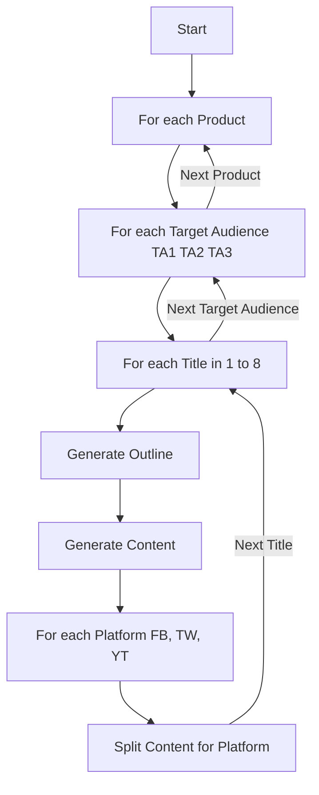
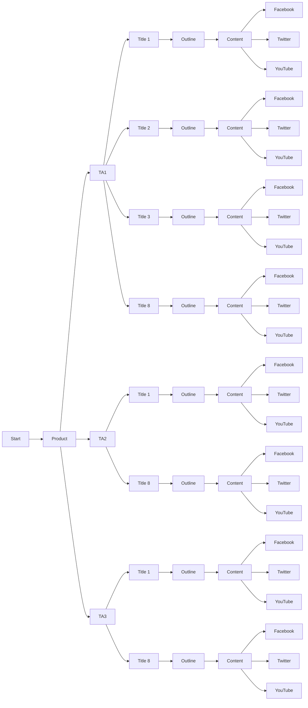

```mermaid
graph TD
    Start[Start] --> P1[For each Product]
    
    P1 --> TA[For each Target Audience TA1 TA2 TA3]
    TA --> Titles[For each Title in 1 to 8]
    Titles --> Outline[Generate Outline]
    Outline --> Content[Generate Content]
    Content --> Platforms[For each Platform FB, TW, YT]
    Platforms --> SplitContent[Split Content for Platform]
    
    SplitContent --> |Next Title| Titles
    Titles --> |Next Target Audience| TA
    TA --> |Next Product| P1
```

```mermaid
graph LR
    Start[Start] --> P1[Product]

    P1 --> TA1[TA1]
    P1 --> TA2[TA2]
    P1 --> TA3[TA3]

    TA1 --> T1A1[Title 1]
    TA1 --> T2A1[Title 2]
    TA1 --> T3A1[Title 3]
    TA1 --> T8A1[Title 8]

    TA2 --> T1A2[Title 1]
    TA2 --> T8A2[Title 8]

    TA3 --> T1A3[Title 1]
    TA3 --> T8A3[Title 8]

    T1A1 --> O1A1[Outline]
    O1A1 --> C1A1[Content]
    C1A1 --> FB1A1[Facebook]
    C1A1 --> TW1A1[Twitter]
    C1A1 --> YT1A1[YouTube]

    T2A1 --> O2A1[Outline]
    O2A1 --> C2A1[Content]
    C2A1 --> FB2A1[Facebook]
    C2A1 --> TW2A1[Twitter]
    C2A1 --> YT2A1[YouTube]

    %% Repeat for other titles in TA1
    T3A1 --> O3A1[Outline]
    O3A1 --> C3A1[Content]
    C3A1 --> FB3A1[Facebook]
    C3A1 --> TW3A1[Twitter]
    C3A1 --> YT3A1[YouTube]

    %% Repeat for other titles in TA1 and other TAs
    T8A1 --> O8A1[Outline]
    O8A1 --> C8A1[Content]
    C8A1 --> FB8A1[Facebook]
    C8A1 --> TW8A1[Twitter]
    C8A1 --> YT8A1[YouTube]

    %% Repeat for TA2 and TA3
    T1A2 --> O1A2[Outline]
    O1A2 --> C1A2[Content]
    C1A2 --> FB1A2[Facebook]
    C1A2 --> TW1A2[Twitter]
    C1A2 --> YT1A2[YouTube]

    T8A2 --> O8A2[Outline]
    O8A2 --> C8A2[Content]
    C8A2 --> FB8A2[Facebook]
    C8A2 --> TW8A2[Twitter]
    C8A2 --> YT8A2[YouTube]

    T1A3 --> O1A3[Outline]
    O1A3 --> C1A3[Content]
    C1A3 --> FB1A3[Facebook]
    C1A3 --> TW1A3[Twitter]
    C1A3 --> YT1A3[YouTube]

    T8A3 --> O8A3[Outline]
    O8A3 --> C8A3[Content]
    C8A3 --> FB8A3[Facebook]
    C8A3 --> TW8A3[Twitter]
    C8A3 --> YT8A3[YouTube]

```